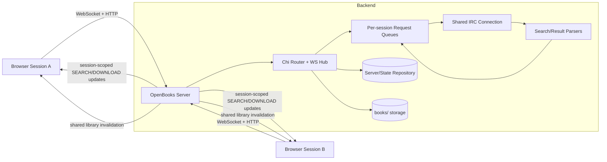
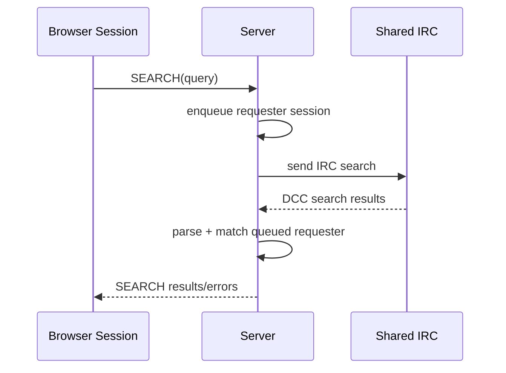
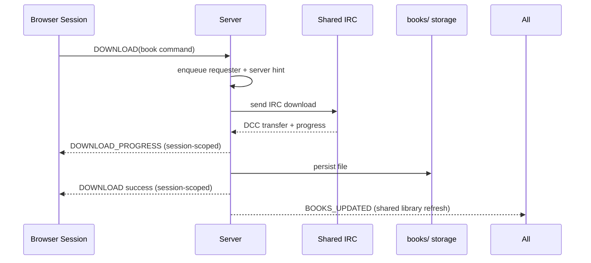

# OpenBooks Fork

A maintained fork of OpenBooks focused on reliability, mobile/desktop UX, and safer multi-session behavior while keeping a single shared IRC backend connection.

## Upstream Attribution

This project is based on the original OpenBooks by Evan Buss:
- Upstream repository: https://github.com/evan-buss/openbooks
- Original Docker image: `evanbuss/openbooks`
- License: MIT (see [LICENSE](LICENSE))

This fork keeps upstream credit and license intact, then layers improvements listed below.

## What This Fork Improves

- Shared IRC backend connection for low IRC load across browser sessions
- Per-session UI isolation for search/download state (phone and desktop no longer overwrite each other)
- Shared library visibility across sessions/devices for the same deployment
- Robust async download mapping and progress handling
- Better source ranking: online first, EPUB preferred, stronger size/format sorting
- Auto EPUB filter default when EPUBs are present (toggleable)
- Retry queue fixes and improved mobile/desktop layout
- Stronger mobile UX (drawer behavior, less intrusive notifications, swipe dismiss)
- Sidebar issue-log export (`normal` + `debug`) for troubleshooting
- Docker and build pipeline updates (Go 1.24 builder, modern frontend deps)

## High-Level Architecture



### Search Flow



### Download Flow



## Quick Start

### Docker Compose (recommended)

From repository root:

```bash
docker compose build
docker compose up -d
```

Default local mapping in this repo is `http://localhost:8383`.

### Run tests/build checks

```bash
go test ./...
```

Frontend build (inside containerized Node toolchain):

```bash
docker run --rm -v "$PWD":/work -w /work/server/app node:18-alpine sh -lc 'npm ci && npm run build'
```

## Runtime Model

- One shared IRC connection per OpenBooks server instance
- Multiple browser sessions can connect simultaneously
- Search/download responses are scoped to the requesting session
- Library/downloaded files are shared across sessions

This balances IRC load efficiency with predictable multi-device UX.

## Security Notes

This fork includes fixes for several common self-hosting risks (basic auth support, websocket origin controls, safer routing, improved request handling).

Still recommended before public exposure:
- Put behind HTTPS reverse proxy
- Use strong `AUTH_USER` / `AUTH_PASS`
- Restrict network exposure to trusted clients
- Keep base image/dependencies updated

## Repository Layout

- `cmd/openbooks/` CLI entrypoint
- `server/` HTTP + WebSocket server
- `server/app/` React frontend
- `core/` IRC parsing/search handling
- `dcc/` DCC transfer logic
- `util/` archive and helper utilities
- `books/` persisted downloads/logs (runtime data)

## Copyright / Legal

OpenBooks is an IRC client for search services. You are responsible for complying with copyright and distribution laws in your jurisdiction.
